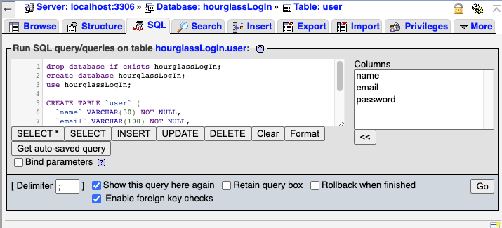

 
[Check out our repo on Github!](https://github.com/is216-supreme/is216-project-group-7)
  
#  :hourglass_flowing_sand: IS216 Project G2 - GROUP 7 - Hourglass :hourglass_flowing_sand:
 
| Name  🤓    | SMU Email |
| ----------- | ----------- |
| Wang Xun Jie | xunjie.wang.2019@scis.smu.edu.sg |
| Ng Jun Hng Aloysius | aloysius.ng.2020@scis.smu.edu.sg |
| Zhao Yanyang | yyzhao.2020@scis.smu.edu.sg |
| Lim Yin Yao | yinyao.lim.2020@scis.smu.edu.sg |
| Tian Fu Wei | fuwei.tian.2020@scis.smu.edu.sg |
 
## :page_facing_up: Project Overview :page_facing_up: ##
#### Describe your project. What is it called? What does it do? Why did you make this web application? Who will benefit from using your web application? Describe your users - who are they? (anyone? or specific target age group or gender? region? country?)
According to Kisi’s Work Life Balance Index, Singapore is the second most overworked city in the world. We hope to address this issue with a calendar/scheduling app that helps nudge the user towards optimal time management and sufficient relaxation. In this project, our team aims to build a web-based calendar portal that consolidates all of the user’s daily itinerary. This webpage allows the user to easily schedule a meetup with another person by simply sharing a link. In addition, the webpage would assess the user’s work-life balance based on his/her schedule and recommend him/her appropriate activities to wind down. We aim to achieve this in a visually attractive and interactive manner.
 
 
## 💻 How to Install and Run Our Web Application (for Developers) 💻  ##
#### If a new developer were to have access to your IS216 project GitHub repo (and subsequently your source code files) and replicate your development environment on his development laptop computer, what are the steps he should take?
* What does he needs to install on his development laptop computer? How can he download your project files and run it on his own computer?
* Provide a step-by-step description of how to get the development environment running. You can choose to do so for at least 1 Operating System (Windows 10 or Mac OS).
* Feel free to use diagrams and images to describe.
 
#### Firstly, you can obtain the source codes from:
https://github.com/is216-supreme/is216-project-group-7
 
Thereafter, you can enter this into your Git CLI  
`gh repo clone is216-supreme/is216-project-group-7`
 
Alternatively, you can use Git or checkout with SVN using this web URL.
https://github.com/is216-supreme/is216-project-group-7.git
 
**Ensure that the files are at the root directory of your webroot**
 
#### Now that you have the files, follow
1. Install MAMP/WAMP (Skip if already installed)
2. Go to `login/database/create.sql` and copy the SQL script  

3. NOTE: Go to `login/include/ConnectionManager.php` and change the database password accordingly (Windows = "" and Mac = "root" by default)  

4. [Go to PHPMyAdmin](http://localhost/phpmyadmin/)  
5. Paste the script into the SQL tab and click on "Go"  

#### [Let's Go!](http://localhost/is216-project-group-7/)

#### Credentials to the Google Account for the app:
email: wadgroup7@gmail.com  
password: Group7password

## 🥳 How to Use Our Web Application (for Visitors to our Website) 🥳 ##
1.	If you do not have an account, proceed to sign up for an account. Otherwise, proceed to step 3 after logging in. 

2.	Click on the sign-up button. Register for an account by keying in your name, email, password and confirm password. Click on “Create Account”. You will be brought to the homepage. 

3.	Once logged in, you will be brought to the homepage. The navbar on top allows you to be brought to the section of the page that you have clicked. The welcome page includes a live time update of country you are currently residing in. 

4.	Under schedule, you will be shown your calendar schedule, retrieved from your google account. You may view the calendar by week or by month. You may also choose to display a specific date by selecting it on the top left-hand corner.

5.	If you need to reschedule your plans, click on “Reschedule my calendar” to make your necessary changes. The updated calendar will then be reflected. 

6.	The weather widget above shows the current weather condition. You may choose to click on it to view the forecasted weather for the next few days. This may help in your schedule planning. 

7.	Refresh your calendar to find out about your workload. Your workload is gauged by the number of hours on your schedule. If the needle is pointing to green, your workload is fine. If the needle is pointing at red, this indicates that you are overworked and is probably feeling stressed. We have also included the number of hours that you have exceeded the recommended work hours (44).

8. If you are feeling stressed, you may de-stress by playing with the 3 activities we have prepared. Click on the icon to proceed to it.

9.	Firstly, the mini game. Read the description and instruction below to find out on how to play the snake game. Once you are done playing, you may choose to click the home icon to go back to the homepage or the icons to go the other two other activities. Alternatively, you may also choose to click on the “Hourglass” button to be brought back to the homepage.

10.	Secondly, the quiz. Read the description and instruction below to find out on how to play the quiz. Once you are done playing, you may choose to click the home icon to go back to the homepage or the icons to go to the other two other activities. Alternatively, you may also choose to click the “Hourglass” button to be brought back to the homepage.

11.	Lastly, the video page. You may choose to play YouTube Trending video of the various categories as well as some of our curated picks. 

12.	Once you are done with our web application, click the “Log Out” button on the navbar to log out. 

 
 
## 🖊 Figma and Web Architechture Diagram 🖊 ##
[Figma Link](https://www.figma.com/file/hwgc9CY1k9HDJzrTKxoZYg/HourGlass)  

#### Web Architechture Diagram  

## 📄 References 📄 ##

#### For Our App Features
| Feature      | Link |
| ----------- | ----------- |
| Calendar | <iframe src="https://calendar.google.com/calendar/embed?src=wadgroup7%40gmail.com&ctz=Asia%2FSingapore" style="border: 0" width="800" height="600" frameborder="0" scrolling="no"></iframe> |
| Calendar Data | https://developers.google.com/calendar/api/v3/reference/events/list?apix_params=%7B%22calendarId%22%3A%22wadgroup7%40gmail.com%22%7D&apix=true#examples |
| Webpage template | https://startbootstrap.com/theme/freelancer |
| BASE Snake Game | https://www.youtube.com/watch?v=xGmXxpIj6vs&t=102s |
| Quiz | https://dev.to/amyoulton/build-a-trivia-game-using-a-free-api-w-javascript-kmn |
| Speedometer | https://codepen.io/kazu_codepen/pen/wGmGjv |
| Youtube API | https://developers.google.com/youtube/iframe_api_reference |

#### For Our Debugging
| Feature      | Link |
| ----------- | ----------- |
| Check if date in this week | https://stackoverflow.com/questions/36787908/how-to-check-if-date-is-in-this-week-in-javascript |
| Disabling Arrow Keys | https://stackoverflow.com/questions/8916620/disable-arrow-key-scrolling-in-users-browser/8916697 |

